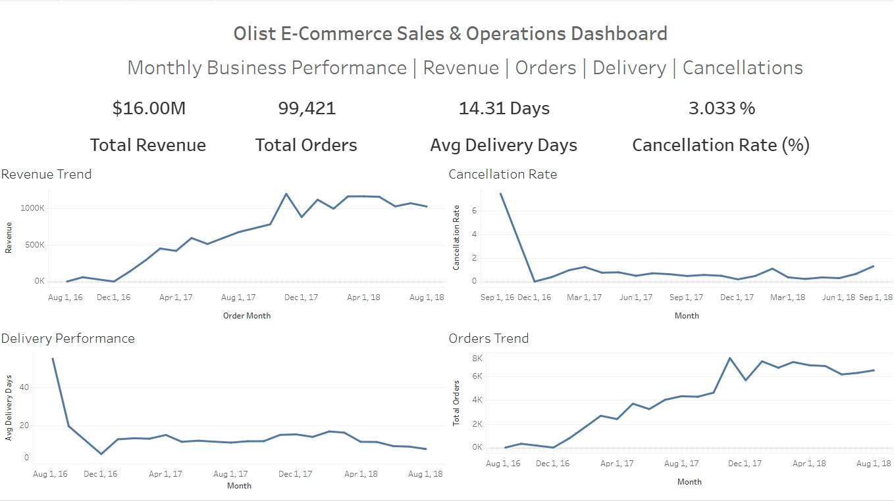
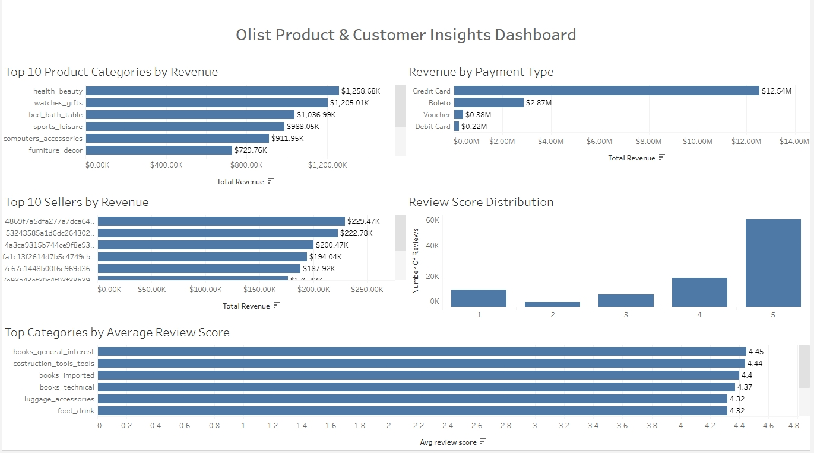

#  Olist E-Commerce Data Analysis
End-to-End Data Analytics Project using Python, SQL (BigQuery), and Tableau Public.

##  Project Overview

This project is an end-to-end Data Analytics project based on the Brazilian Olist E-Commerce dataset.

The objective was to analyze business performance, customer behavior, product sales, seller performance, and operational metrics using Python, SQL (Google BigQuery), and Tableau.

The project follows the complete data analytics workflow from data cleaning to interactive dashboard creation.

---

## Business Objectives

- Analyze monthly revenue trends
- Monitor order performance
- Measure cancellation rates
- Evaluate delivery performance
- Identify top-selling product categories
- Analyze payment method preferences
- Identify top-performing sellers
- Measure customer satisfaction using review scores

---

##  Tools & Technologies

- Python (Pandas, NumPy)
- Google BigQuery (SQL)
- Tableau Public
- GitHub

---

## Dataset

**Dataset:** Brazilian E-Commerce Public Dataset by Olist

The dataset contains information about:

- Customers
- Orders
- Order Items
- Products
- Sellers
- Payments
- Reviews
- Geolocation
- Category translation
---

##  Dashboards

### Dashboard 1 – Executive Overview

Includes:

- Monthly Revenue
- Total Orders
- Cancellation Rate
- Average Delivery Days

---

### Dashboard 2 – Product & Customer Insights

Includes:

- Top Product Categories by Revenue
- Revenue by Payment Type
- Top Sellers by Revenue
- Review Score Distribution
- Top Categories by Average Review Score

---

## Key Business Insights

- Revenue showed consistent growth throughout most of the analysis period.
- Credit Card was the most preferred payment method, contributing the highest revenue.
- Health Beauty and Bed Bath Table were among the highest revenue-generating product categories.
- Most customers rated their purchases with 5-star reviews, indicating high customer satisfaction.
- A small number of sellers contributed a significant portion of total revenue.
- Average delivery time remained stable, while the cancellation rate stayed relatively low.

---

## Author

**Manjunatha R J**

Aspiring Data Analyst

Skills:
- Python
- SQL
- Google BigQuery
- Tableau
- Excel

---

# Dashboard Preview

## Dashboard 1 - Executive Overview

---

## Dashboard 2 - Product & Customer Insights

##  Interactive Tableau Dashboard

[View the Interactive Tableau Dashboard](https://public.tableau.com/views/OlistExecutiveDashboard_17840465623420/OlistE-CommerceSalesOperationsDashboard?:language=en-US&:sid=&:redirect=auth&:display_count=n&:origin=viz_share_link)
